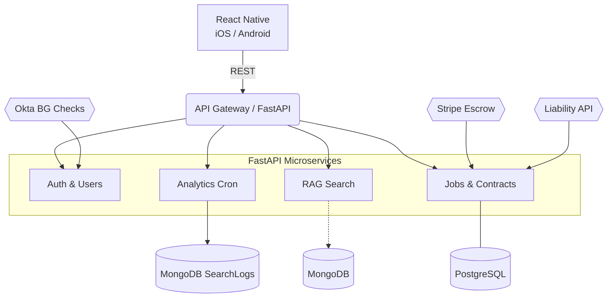

# KonTask 🌀  
*AI-powered local-services marketplace for Downtown Greencastle*

[](#license)  


KonTask matches residents, students, and visitors with verified local service providers ― plumbers, nail artists, personal trainers, tutors, ride-share drivers, and more ― in **seconds**.  
Built by Huy Tran and team for the Greencastle community, KonTask fuses a traditional SQL backend with a Retrieval-Augmented Generation (RAG) search layer to deliver *private, fast, and trust-centric* bookings.

---

## Table of Contents
1. [Problem Statement](#problem-statement)  
2. [Features](#features)  
3. [Tech Stack](#tech-stack)  
4. [Solution Architecture](#solution-architecture)  
5. [Project Structure](#project-structure)  
6. [Getting Started](#getting-started)  
7. [Running Locally](#running-locally)  
8. [Environment Variables](#environment-variables)  
9. [Tests](#tests)  
10. [Roadmap](#roadmap)  
11. [Contributing](#contributing)  
12. [License](#license)

---

## Problem Statement
- **96 %** of Greencastle service seekers failed to book local help due to discovery issues.  
- **100 %** of providers cited *finding customers* as their top barrier.  
Traditional bulletin boards and social-media posts produce spam, slow response times, and fragmented trust signals.

---

## Features
| Category | Highlights |
|----------|------------|
| **AI Smart Matching** | OpenAI-powered RAG engine embeds provider résumés, cross-checks location, rating & availability, and returns the *best* matches. |
| **Two-Way Acceptance** | Customers request → providers accept → Stripe escrow holds funds until task completion. |
| **24-Hour Marketplace** | If no instant match, the request auto-posts for bidding so you’re never stuck waiting. |
| **Ratings & Reviews** | 5-star ratings on both sides; rolling averages feed back into match score. |
| **Provider Dashboard** | Real-time analytics (views, inquiries, conversion, earnings). |
| **Safety** | Okta background checks + Allstate liability coverage on every task. |

---

## Tech Stack
| Layer | Choices |
|-------|---------|
| **Mobile** | React Native *(Expo)* |
| **Backend** | Python 3.11 · FastAPI · Uvicorn |
| **Data** | PostgreSQL (transactions) · MongoDB Atlas (search logs) |
| **Vector DB** | MongoDB |
| **AI** | OpenAI Embeddings · GPT-4o (summaries) |
| **Auth** | Okta JWT |
| **Payments** | Stripe Connect |
| **Infra** | Docker · GitHub Actions CI · Render (API) · Vercel (web) |

---

## Solution Architecture

## Project Structure
```text
konTask/
├── mobile/                 # React Native app (Expo)
├── backend/
│   ├── app/
│   │   ├── main.py         # FastAPI entry-point
│   │   ├── api/            # Route modules
│   │   ├── core/           # Settings, logging
│   │   ├── db/             # SQLAlchemy models, session
│   │   ├── rag/            # Embedding, vector search, re-rank
│   │   └── services/       # Stripe, Okta, Allstate wrappers
│   └── Dockerfile
├── infra/
│   ├── docker-compose.yml
│   └── terraform/          # (optional) IaC for cloud resources
└── README.md
```

## Getting Started

### Prerequisites
- Docker ≥ 24  
- Node.js ≥ 20 & Yarn (for mobile)  
- Python ≥ 3.11  
- OpenAI & MongoDB API keys  

### Quick Start
```bash
# 1. Clone the repo
git clone https://github.com/<your-org>/konTask.git
cd konTask

# 2. Spin up Postgres & Mongo in Docker
docker compose up -d db mongo

# 3. Back-end (FastAPI)
cd backend
python -m venv .venv && source .venv/bin/activate
pip install -r requirements.txt
uvicorn app.main:app --reload

# 4. Mobile (Expo)
cd ../mobile
yarn install
expo start
```

### Running Locally
| Task                       | Command                                  |
|----------------------------|-------------------------------------------|
| Database migrations        | `alembic upgrade head`                   |
| Seed sample providers      | `python scripts/seed_demo.py`            |
| Run tests                  | `pytest -q`                              |
| Generate coverage report   | `pytest --cov=app --cov-report=html`     |

### Environment Variables
Create a `.env` file in both `backend/` and `mobile/` directories with the following keys:

| Variable                     | Purpose                           |
|------------------------------|-----------------------------------|
| `DATABASE_URL`               | Postgres connection string        |
| `MONGO_URI`                  | MongoDB Atlas URI                 |
| `MongoDB_API_KEY`           | MongoDB API key                  |
| `MongoDB_ENV`               | MongoDB environment/region       |
| `OPENAI_API_KEY`             | OpenAI embeddings & GPT access    |
| `STRIPE_SECRET_KEY`          | Stripe payments                   |
| `OKTA_DOMAIN`                | Okta background-check domain      |
| `OKTA_API_TOKEN`             | Okta API token                    |

### Tests
```bash
# Run API & RAG unit tests
pytest backend/app
```
> CI will run linting and tests on every pull request via GitHub Actions.

## Roadmap
- Deploy RAG microservice separately (async workers)  
- Add synonym & spell-correction pre-processor  
- Implement push notifications (Expo + Socket.IO)  
- Support multilingual UI (EN, ES, VI)  
- Regional rollout: Bloomington → Terre Haute  

## Contributing
1. Fork the repository and create your branch:  
   ```bash
   git checkout -b feature/awesome
   ```
2. Commit your changes:  
   ```bash
   git commit -m 'feat: add awesome feature'
   ```
3. Push to your branch:  
   ```bash
   git push origin feature/awesome
   ```
4. Open a Pull Request! 🎉  

Please follow the existing code style (Black, Ruff) and include unit tests for new functionality.

## License
Distributed under the MIT License. See [LICENSE](LICENSE) for details.

> “KonTask isn’t just an app; it’s a bet on Greencastle’s revival.  
> Let’s build the town we all want to live in — one perfectly matched task at a time.”  
```
